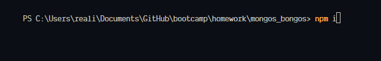

# Mongos Bongos API

## Description

Just a bare bones mock up of a social network api. Users have thoughts and thoughts can have reactions by other users. Just an implemention on top of mongo to keep skills fresh and in the frontal cortex.

## Table Of Cotents

- [Description](#description)
- [Installation And Usage](#installation)
- [Demo](#demo)

## Installation
To get this up and runing simply download the repo. Extract and navigate your command prompt to the folder. Your then going to want to run `npm i`. This will download all the require node modules. Next you are going to want to make sure you have a mongoDb server up and runing. That can be found [here](https://www.mongodb.com/try/download/community). After that just navigate to the root folder of the repo and run `node server`. Now you are up and runing and can hit the end points.

Step 1

Step 2

Step 3

Step 4

## Demo

You can find a video demnostration [here](https://app.castify.com/view/9df666fb-f3e3-4a99-8ec0-a458a1c9aa91).